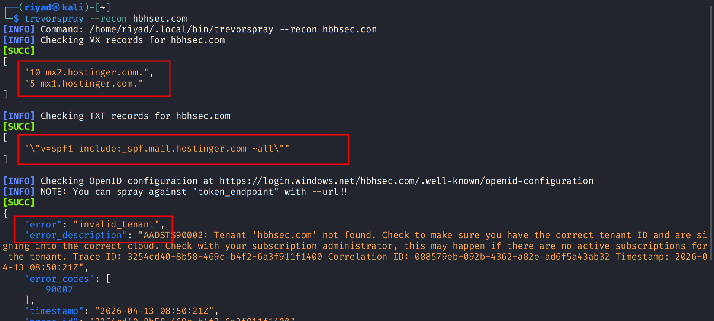
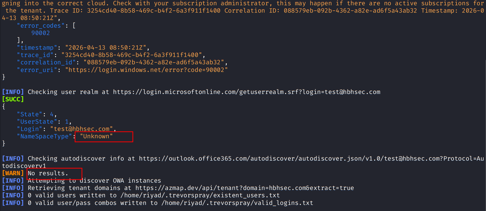
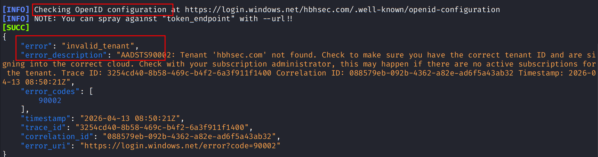
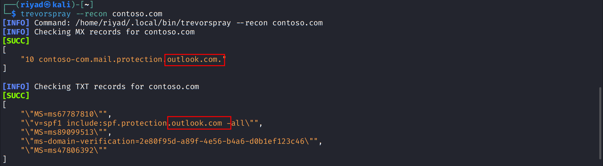
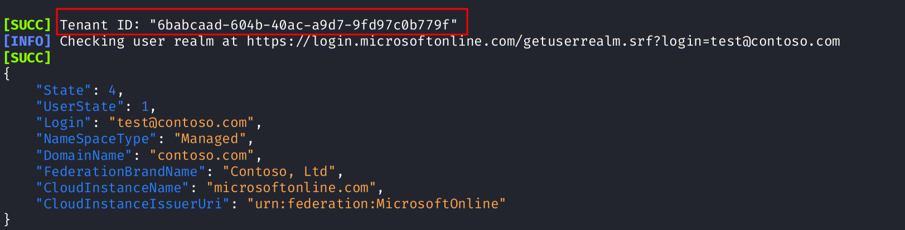
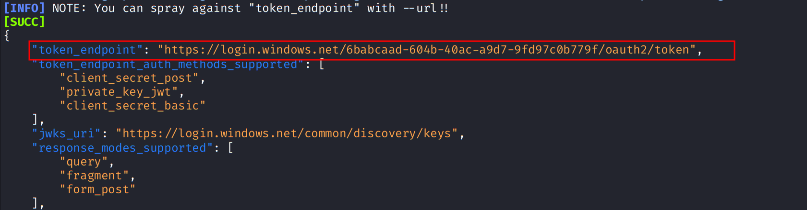
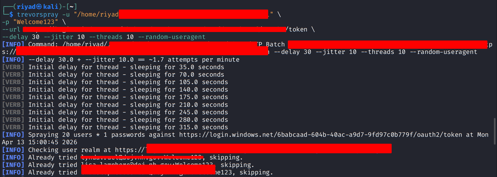

# External Network Recon & Identity Analysis Lab

This lab focuses on external network reconnaissance and identity system analysis.

---

## Non-Microsoft 365 Domain Recon (hbhsec.com)

Command:
trevorspray --recon hbhsec.com

Findings:
- Hostinger MX records
- SPF Hostinger
- OpenID invalid tenant

Conclusion:
Non-Microsoft 365 system

---

### Screenshots

  
  

---

## Microsoft 365 Recon (contoso.com)

Command:
trevorspray --recon contoso.com

Findings:
- Outlook MX
- Azure AD detected
- Tenant ID present
- Managed authentication system

Conclusion:
Enterprise Microsoft 365 system

---

### Screenshots

  
  

---

## Password Spraying Simulation (Lab Only)

A controlled authentication testing simulation was performed to understand login behavior differences.

Focus:
- Valid vs invalid response behavior
- Authentication flow understanding
- Security posture analysis

---

### Screenshot

---

## Final Summary

Learned how DNS and identity systems help identify enterprise infrastructure and authentication mechanisms.
